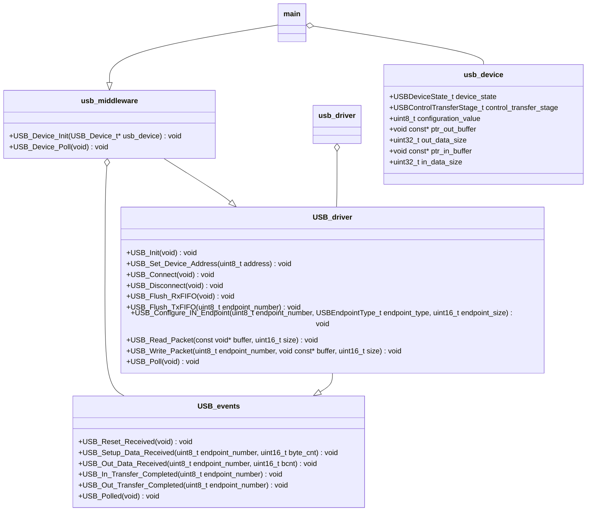

# stm32f429i-disc1
Embedded project for implementing an USB slave driver in a [stm32f429i-disc1](https://www.st.com/en/evaluation-tools/32f429idiscovery.html) board.

## Building
This project uses [waf](https://waf.io/) as building enviroment. The compiled waf application is commited in this repository (version 2.0.25). The basic commands are set in a vscode configuration file for using this IDE ([tasks.json](.vscode/tasks.json)), and they are the following:  
For configuring:
```console
python waf configure
```
For building:
```console
python waf build
```
For cleaning:
```console
python waf clean
```
For distcleaning (remove the configuration):
```console
python waf distclean
```

## Architecture
For the USB driver implementation I have used an opaque object design pattern. Here you can find a UML diagram of the architecture:

