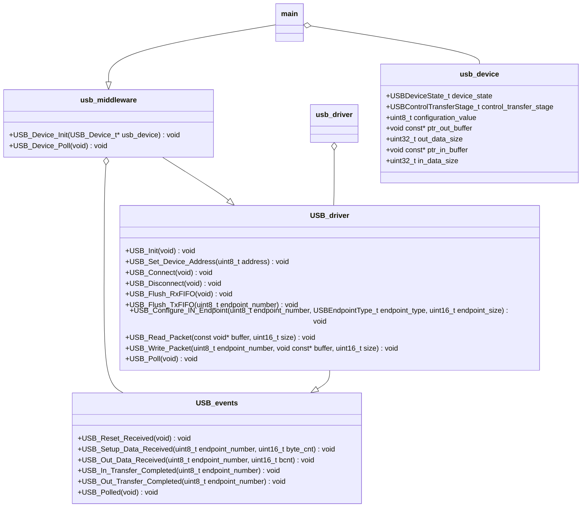

# stm32f429i-disc1
Embedded project for implementing an USB slave driver in a [stm32f429i-disc1](https://www.st.com/en/evaluation-tools/32f429idiscovery.html) board.

## Building
This project uses [waf](https://waf.io/) as building enviroment. The compiled waf application is commited in this repository (version 2.0.25). The basic commands are set in a vscode configuration file for using this IDE ([tasks.json](.vscode/tasks.json)), and they are the following:  
For configuring:
```console
python waf configure
```
For building:
```console
python waf build
```
For cleaning:
```console
python waf clean
```
For distcleaning (remove the configuration):
```console
python waf distclean
```

## Architecture
For the USB driver implementation I have used an opaque object design pattern.  
Here you can find an UML diagram of the architecture:


## Testing
For testing this application you need to connect the USB USER connector of the stm32f429i-disc1 to the host computer and the USB ST-LINK which you will use to program the board.
Once the firmware is running you will see your mouse moving to the right as in this image:  
If you are using a Linux OS in the host machine you can use the dmesg command for getting some information about the USB:
```console
  [14049.359626] usb 1-1: new full-speed USB device number 6 using xhci_hcd
  [14054.880110] usb 1-1: config 1 has an invalid interface number: 1 but max is 0
  [14054.880129] usb 1-1: config 1 has no interface number 0
  [14054.880143] usb 1-1: New USB device found, idVendor=6666, idProduct=13aa, bcdDevice= 1.00
  [14054.880154] usb 1-1: New USB device strings: Mfr=0, Product=0, SerialNumber=0
  [14054.886040] input: HID 6666:13aa as /devices/pci0000:00/0000:00:14.0/usb1/1-1/1-1:1.1/0003:6666:13AA.0003/input/input22
  [14054.886513] hid-generic 0003:6666:13AA.0003: input,hidraw2: USB HID v1.00 Mouse [HID 6666:13aa] on usb-0000:00:14.0-1/input1
```
Some debug information can be optained through the ITM debug port of the cortex-M4F (you can use STM32CubeProgrammer for this purpose):
```console
  [INFO] Program entrypoint
  [INFO] USB reset signal was detected
  [INFO] USB device speed enumeration done
  [DEBUG] SETUP data: [8]: {0x80, 0x06, 0x00, 0x01, 0x00, 0x00, 0x40, 0x00}
  [INFO] Standard Get Descriptor request received
  [INFO] - Get Device Descriptor
  [INFO] Switching control transfer stage to IN-DATA
  [INFO] Processing IN-DATA stage
  [INFO] Switching control stage to IN-DATA IDLE
  [INFO] Switching control stage to IN-DATA
  [INFO] Processing IN-DATA stage
  [INFO] Switching control stage to IN-DATA IDLE
  [INFO] USB device speed enumeration done
  [DEBUG] SETUP data: [8]: {0x00, 0x05, 0x06, 0x00, 0x00, 0x00, 0x00, 0x00}
  [INFO] Standard Set Address request received
  [INFO] Switching control transfer stage to IN-STATUS
  [INFO] Switching control transfer stage to SETUP
  [INFO] Switching control stage to IN-DATA
  [INFO] Processing IN-DATA stage
  [INFO] Switching control stage to IN-DATA IDLE
  [DEBUG] SETUP data: [8]: {0x80, 0x06, 0x00, 0x01, 0x00, 0x00, 0x12, 0x00}
  [INFO] Standard Get Descriptor request received
  [INFO] - Get Device Descriptor
  [INFO] Switching control transfer stage to IN-DATA
  [INFO] Processing IN-DATA stage
  [INFO] Switching control stage to IN-DATA IDLE
  [INFO] Switching control stage to IN-DATA
  [INFO] Processing IN-DATA stage
  [INFO] Switching control stage to IN-DATA IDLE
  [DEBUG] SETUP data: [8]: {0x80, 0x06, 0x00, 0x01, 0x00, 0x00, 0x12, 0x00}
  [INFO] Standard Get Descriptor request received
  [INFO] - Get Device Descriptor
  [INFO] Switching control transfer stage to IN-DATA
  [INFO] Processing IN-DATA stage
  [INFO] Switching control stage to IN-DATA IDLE
  [INFO] Switching control stage to IN-DATA
  [INFO] Processing IN-DATA stage
  [INFO] Switching control stage to IN-DATA IDLE
  [INFO] USB device speed enumeration done
  [DEBUG] SETUP data: [8]: {0x80, 0x06, 0x00, 0x01, 0x00, 0x00, 0x40, 0x00}
  [INFO] Standard Get Descriptor request received
  [INFO] - Get Device Descriptor
  [INFO] Switching control transfer stage to IN-DATA
  [INFO] Processing IN-DATA stage
  [INFO] Switching control stage to IN-DATA IDLE
  [INFO] Switching control [INFO] USB device speed enumeration done
  [DEBUG] SETUP data: [8]: {0x80, 0x06, 0x00, 0x01, 0x00, 0x00, 0x40, 0x00}
  [INFO] Standard Get Descriptor request received
  [INFO] - Get Device Descriptor
  [INFO] Switching control transfer stage to IN-DATA
  [INFO] Processing IN-DATA stage
  [INFO] Switching control stage to IN-DATA IDLE
  [INFO] Switching control stage to IN-DATA
  [INFO] Processing IN-DATA stage
  [INFO] Switching control stage to IN-DATA IDLE
  [INFO] USB device speed enumeration done
  [DEBUG] SETUP data: [8]: {0x00, 0x05, 0x07, 0x00, 0x00, 0x00, 0x00, 0x00}
  [INFO] Standard Set Address request received
  [INFO] Switching control transfer stage to IN-STATUS
  [INFO] Switching control transfer stage to SETUP
  [INFO] Switching control stage to IN-DATA
  [INFO] Processing IN-DATA stage
  [INFO] Switching control stage to IN-DATA IDLE
  [DEBUG] SETUP data: [8]: {0x80, 0x06, 0x00, 0x01, 0x00, 0x00, 0x12, 0x00}
  [INFO] Standard Get Descriptor request received
  [INFO] - Get Device Descriptor
  [INFO] Switching control transfer stage to IN-DATA
  [INFO] Processing IN-DATA stage
  [INFO] Switching control stage to IN-DATA IDLE
  [INFO] Switching control stage to IN-DATA
  [INFO] Processing IN-DATA stage
  [INFO] Switching control stage to IN-DATA IDLE
  [DEBUG] SETUP data: [8]: {0x80, 0x06, 0x00, 0x01, 0x00, 0x00, 0x12, 0x00}
  [INFO] Standard Get Descriptor request received
  [INFO] - Get Device Descriptor
  [INFO] Switching control transfer stage to IN-DATA
  [INFO] Processing IN-DATA stage
  [INFO] Switching control stage to IN-DATA IDLE
  [INFO] Switching control stage to IN-DATA
  [INFO] Processing IN-DATA stage
  [INFO] Switching control stage to IN-DATA IDLE
  [INFO] USB reset signal was detected
  [INFO] USB device speed enumeration done
  [INFO] USB reset signal was detected
  [INFO] USB device speed enumeration done
  [DEBUG] SETUP data: [8]: {0x00, 0x05, 0x08, 0x00, 0x00, 0x00, 0x00, 0x00}
  [INFO] Standard Set Address request received
  [INFO] Switching control transfer stage to IN-STATUS
  [INFO] Switching control transfer stage to SETUP
  [DEBUG] SETUP data: [8]: {0x80, 0x06, 0x00, 0x01, 0x00, 0x00, 0x08, 0x00}
  [INFO] Standard Get Descriptor request received
  [INFO] - Get Device Descriptor
  [INFO] Switching control transfer stage to IN-DATA
  [INFO] Processing IN-DATA stage
  [INFO] Switching control stage to IN-DATA ZERO
  [INFO] Switching control stage to OUT STATUS
  [INFO] Switching control stage to SETUP
  [DEBUG] SETUP data: [8]: {0x80, 0x06, 0x00, 0x01, 0x00, 0x00, 0x12, 0x00}
  [INFO] Standard Get Descriptor request received
  [INFO] - Get Device Descriptor
  [INFO] Switching control transfer stage to IN-DATA
  [INFO] Processing IN-DATA stage
  [INFO] Switching control stage to IN-DATA IDLE
  [DEBUG] SETUP data: [8]: {0x80, 0x06, 0x00, 0x01, 0x00, 0x00, 0x12, 0x00}
  [INFO] Standard Get Descriptor request received
  [INFO] - Get Device Descriptor
  [INFO] Switching control transfer stage to IN-DATA
  [INFO] Processing IN-DATA stage
  [INFO] Switching control stage to IN-DATA IDLE
  [INFO] Switching control stage to IN-DATA
  [INFO] Processing IN-DATA stage
  [INFO] Switching control stage to IN-DATA IDLE
  [INF[DEBUG] SETUP data: [8]: {0x80, 0x06, 0x00, 0x02, 0x00, 0x00, 0x09, 0x00}
  [INFO] Standard Get Descriptor request received
  [INFO] - Get Configuration Descriptor
  [INFO] Switching control transfer stage to IN-DATA
  [INFO] Processing IN-DATA stage
  [INFO] Switching control stage to IN-DATA IDLE
  [INFO] Switching control stage to IN-DATA
  [INFO] Processing IN-DATA stage
  [INFO] Switching control stage to OUT-STATUS
  [INFO] Switching control stage to SETUP
  [DEBUG] SETUP data: [8]: {0x80, 0x06, 0x00, 0x02, 0x00, 0x00, 0x22, 0x00}
  [INFO] Standard Get Descriptor request received
  [INFO] - Get Configuration Descriptor
  [INFO] Switching control transfer stage to IN-DATA
  [INFO] Processing IN-DATA stage
  [INFO] Switching control stage to IN-DATA IDLE
  [INFO] Switching control stage to IN-DATA
  [INFO] Processing IN-DATA stage
  [INFO] Switching control stage to IN-DATA IDLE
  [INFO] Switching control stage to IN-DATA
  [INFO] Processing IN-DATA stage
  [INFO] Switching control stage to IN-DATA IDLE
  [INFO] Switching control stage to IN-DATA
  [INFO] Processing IN-DATA stage
  [INFO] Switching control stage to IN-DATA IDLE
  [INFO] Switching control stage to IN-DATA
  [INFO] Processing IN-DATA stage
  [INFO] Switching control stage to OUT-STATUS
  [INFO] Switching control stage to SETUP
  [DEBUG] SETUP data: [8]: {0x00, 0x09, 0x01, 0x00, 0x00, 0x00, 0x00, 0x00}
  [INFO] Standard Set Configuration request received
  [INFO] Switching control transfer state to IN-STATUS
  [INFO] Switching control transfer stage to SETUP
  [DEBUG] SETUP data: [8]: {0x21, 0x0A, 0x00, 0x00, 0x01, 0x00, 0x00, 0x00}
  [INFO] Switching control transfer stage to IN-STATUS
  [INFO] Switching control transfer stage to SETUP
  [DEBUG] SETUP data: [8]: {0x81, 0x06, 0x00, 0x22, 0x01, 0x00, 0x30, 0x00}
  [INFO] Switching control transfer stage to IN-STATUS
  [INFO] Processing IN-DATA stage
  [INFO] Switching control stage to IN-DATA IDLE
  [INFO] Switching control stage to IN-DATA
  [INFO] Processing IN-DATA stage
  [INFO] Switching control stage to IN-DATA IDLE
  [INFO] Switching control stage to IN-DATA
  [INFO] Processi[DEBUG] Sending USB HID mouse report
  [DEBUG] Sending USB HID mouse report
  [DEBUG] Sending USB HID mouse report
  [DEBUG] Sending USB HID mouse report
  [DEBUG] Sending USB HID mouse report
  [DEBUG] Sending USB HID mouse report
  ...
```

You can also use the wireshark utility for debugging or testing the USB implementation, I have attached here a log file, you can open it and use the following filter configuration for getting the USB driver communication:
```
(usb.addr != "1.5.0") && (usb.addr != "1.5.1") && (usb.addr != "1.5.2") && (usb.addr != "1.5.3") && (usb.addr != "1.4.0") && (usb.addr != "1.4.2") && (usb.addr != "1.0.0") && (usb.addr != "1.1.0") && (usb.addr != "1.1.1") && (usb.addr != "1.10.0") && (usb.addr != "1.11.0")
```
